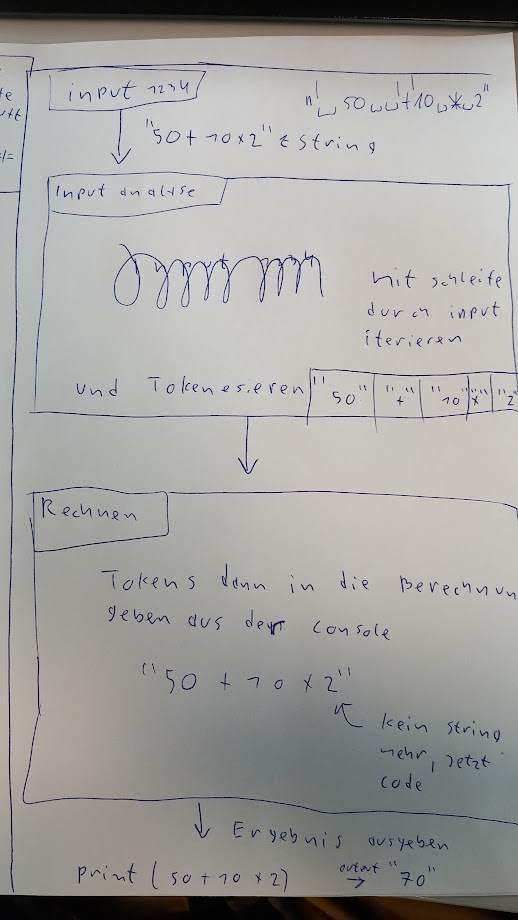
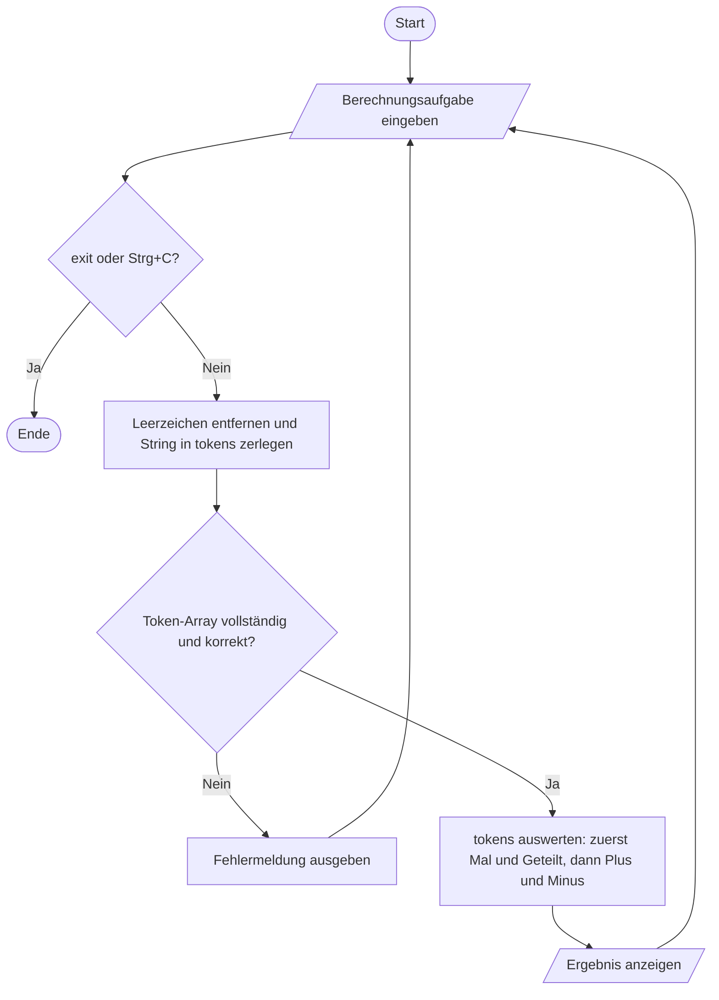

# Aufgabe

    Schreiben Sie in Javascript ein kleines Projekt:

       Kleiner Taschenrechner:
          - mit einer Eingabezeile in die eine komplette
            Berechnungsaufgabe geschreiben wird.
          - mit ENTER in dieser Eingabezeile startet die
            Auswertung und Berechnung
          - das Ergebnis wird anschließend unter der
            Eingabezeile angezeigt.
          - Anschließend kann eien neue Berechnungsaufgabe
            angegeben werden;
          - Abbruch: ^C/exit in der Eingabezeile

          Die Eingabezeile soll analysiert werden ob alle
          eingegebenen Elemente Zahlen oder gültige Operatoren
          in korrekter Reihenfolge sind; z.B. +++ ist falsch usw.
          Zu verarbeitende Operatoren +, - *, /

       Vorgehensweise:
          Einen "Plan" für diese Aufgabe erstellen, wie sie
          vorhaben die Aufgabe zu lösen:
            den Plan bitte auf Papier skizzieren; Drawio zulässig

          Programmierung vor "Bewilligung" des Plan ist verboten!

          Vorgabe: Javascript Project mit npm anlegen
                   alles in einer Javascript Datei: index.js

        Zeitvorgabe: 10:00 - 16:00 Uhr
            15:45 Uhr Rücksprache bzgl. Verlängerung!

## Handskizze

## Geplante Umsetzung

1. Die komplette Berechnungsaufgabe als String einlesen von der Konsole
2. Leerzeichen entfernen und den String in ein Array `tokens` zerlegen. Jedes Element ist entweder eine Zahl oder einer der Operatoren `+`, `-`, `*`, `/`.
3. Prüfen, ob die Tokenisierung den gesamten String erfasst hat und die Elemente abwechselnd Zahl, Operator, Zahl sind. Der erste und letzte Eintrag müssen Zahlen sein.
4. Bei ungültiger Eingabe eine Fehlermeldung anzeigen und eine neue Aufgabe einlesen.
5. Das gültige `tokens`-Array auswerten: zuerst `*` und `/` von links nach rechts berechnen, danach `+` und `-` von links nach rechts. Division durch null als Fehler behandeln.
6. Das Ergebnis in der konsole anzeigen und wieder eine neue Aufgabe in die konsole einlesen.

## Programmablauf als Mermaid

<!-- markdownlint-disable MD046 -->

<!-- markdownlint-enable MD046 -->
Abbruch: `exit` in der Eingabe oder `Strg+C` im Terminal beendet das Programm.
<!-- markdownlint-disable-next-line MD012 -->
