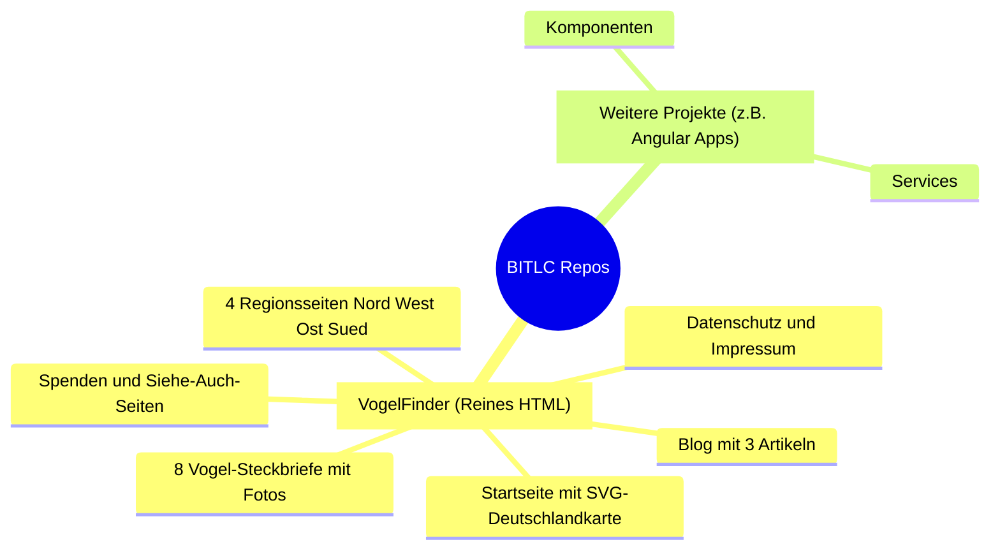
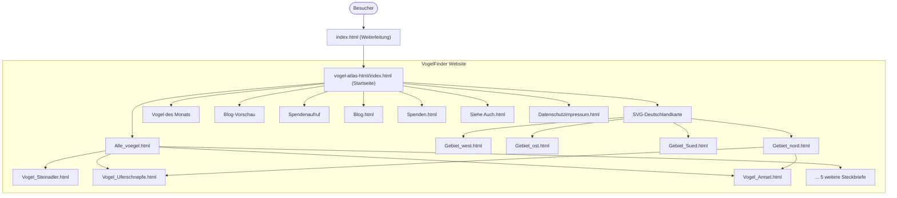

# BITLC Projects Repository

Herzlich willkommen im Projekt-Repository. Dieses Repository ist modular aufgebaut: Jedes Teilprojekt bzw. jede Web-App befindet sich in einem eigenen, klar abgegrenzten Unterordner mit eigener Dokumentation und Quellcode.

---

## Inhaltsverzeichnis (TOC)

1. [Projektübersicht](#projektübersicht)
2. [Repository-Struktur](#repository-struktur)
3. [Unterprojekte](#unterprojekte)
   - [1. VogelFinder – Vogel Atlas Deutschland (HTML)](#1-vogelfinder--vogel-atlas-deutschland-html)
4. [Architektur & Navigationsfluss](#architektur--navigationsfluss)
5. [Code-Beispiel](#code-beispiel)
6. [Bereitstellung auf GitHub Pages (Direkt im Browser ansehen)](#bereitstellung-auf-github-pages-direkt-im-browser-ansehen)
7. [Lokale Installation & Ausführung](#lokale-installation--ausführung)

---

## Projektübersicht

Das Repository dient als Sammelbecken für UI-Konzepte, Webanwendungen und Prototypen (von nativem HTML bis hin zu modernen Framework-Apps wie Angular).



---

## Repository-Struktur

```text
BITLC-Angular/
├── .agents/                          # Richtlinien, Kontext & Arbeitsplan
│   ├── agents.md                     # Agenten-Richtlinien & Verhaltensregeln
│   ├── context.md                    # Projekt-Kontext & Historie
│   └── workplan.md                   # Historischer und zukünftiger Arbeitsplan
├── .vscode/                          # Editor-spezifische Einstellungen
├── index.html                        # Root-Weiterleitung → vogel-atlas-html/
├── vogel-atlas-html/                 # Unterprojekt: VogelFinder
│   ├── Assets/                       # Bilder, Fotos & GIFs (12 Dateien)
│   ├── index.html                    # Startseite mit SVG-Karte & Vogel des Monats
│   ├── Alle_voegel.html              # Übersicht aller 8 Vogelarten (Bildergalerie)
│   ├── Vogel_Amsel.html              # Steckbrief: Amsel
│   ├── Vogel_Halsbandsittich.html    # Steckbrief: Halsbandsittich
│   ├── Vogel_Haussperling.html       # Steckbrief: Haussperling
│   ├── Vogel_Kohlmeise.html          # Steckbrief: Kohlmeise
│   ├── Vogel_Nebelkraehe.html        # Steckbrief: Nebelkrähe
│   ├── Vogel_Rotkehlchen.html        # Steckbrief: Rotkehlchen
│   ├── Vogel_Steinadler.html         # Steckbrief: Steinadler
│   ├── Vogel_Uferschnepfe.html       # Steckbrief: Uferschnepfe
│   ├── Gebiet_nord.html              # Region: Norddeutschland
│   ├── Gebiet_west.html              # Region: Westdeutschland
│   ├── Gebiet_ost.html               # Region: Ostdeutschland
│   ├── Gebiet_Sued.html              # Region: Süddeutschland
│   ├── Blog.html                     # Blog mit 3 Artikeln
│   ├── Spenden.html                  # Spendenseite
│   ├── Siehe Auch.html               # Weiterführende Links
│   ├── Datenschutzimpressum.html     # Impressum & Datenschutz
│   ├── template.html                 # Wiederverwendbare Seitenvorlage
│   └── README.md                     # Unterprojekt-Dokumentation
└── README.md                         # Hauptdokumentation (diese Datei)
```

---

## Unterprojekte

### 1. VogelFinder – Vogel Atlas Deutschland (HTML)

- **Ordner:** [`/vogel-atlas-html`](./vogel-atlas-html/)
- **Unterliegende Dokumentation:** [vogel-atlas-html/README.md](./vogel-atlas-html/README.md)
- **Beschreibung:** Ein nach einer Handskizze entworfener Prototyp für einen deutschen Vogel-Atlas – mittlerweile zu einer vollständigen Multi-Page-Website mit 18 HTML-Seiten ausgebaut.
- **Technologien:** Reines HTML5 (ohne CSS, ohne JavaScript), Bilder (JPG/PNG/GIF), Inline-SVG, semantische Struktur.
- **Umfang:**
  - 8 Vogel-Steckbriefe mit Fotos (Amsel, Halsbandsittich, Haussperling, Kohlmeise, Nebelkrähe, Rotkehlchen, Steinadler, Uferschnepfe)
  - 4 Regionsseiten (Nord, West, Ost, Süd) mit regionaler Vogelauswahl
  - Blog mit 3 Artikeln, Spendenseite, Siehe-Auch und Datenschutz/Impressum
  - Interaktive SVG-Deutschlandkarte mit klickbaren Regionen
  - Einheitliches Template-System mit Breadcrumb-Navigation
- **Vorschau:** [`vogel-atlas-html/index.html`](./vogel-atlas-html/index.html)

---

## Architektur & Navigationsfluss



---

## Code-Beispiel

Auszug aus der barrierefreien und klickbaren Vektorkarte (`vogel-atlas-html/index.html`):

```html
<!-- Klickbare Region Norddeutschland innerhalb der SVG-Karte -->
<svg viewBox="0 0 600 750" xmlns="http://www.w3.org/2000/svg">
    <a href="Gebiet_nord.html">
        <path d="M180,60 L380,40 L450,110 L410,210 L190,200 Z" fill="#d0e1fd" stroke="#333333" stroke-width="2">
            <title>Norddeutschland (SH, HH, MV, NI, HB)</title>
        </path>
        <text x="270" y="130" font-family="sans-serif" font-size="16" fill="#111" font-weight="bold">
            Norddeutschland
        </text>
    </a>
</svg>
```

---

## Bereitstellung auf GitHub Pages (Direkt im Browser ansehen)

GitHub stellt HTML-Dateien standardmäßig im Repository nur als Quelltext dar. Damit Nutzer und Betrachter die Website **sofort interaktiv als echte Webseite im Browser** sehen können, gibt es **Github Pages**

<https://j-moessmer.github.io/BITLC-Angular/vogel-atlas-html/>

---

## Lokale Installation & Ausführung

Für das reine HTML-Projekt ist keine Installation von `node` oder `npm` erforderlich:

1. **Repository klonen:**

   ```bash
   git clone https://github.com/J-Moessmer/BITLC-Angular.git
   cd BITLC-Angular
   ```

2. **Im Browser ansehen:**
   - Datei `vogel-atlas-html/index.html` direkt per Doppelklick öffnen.
   - Alternativ in VS Code Rechtsklick &rarr; **Open with Live Server**.
