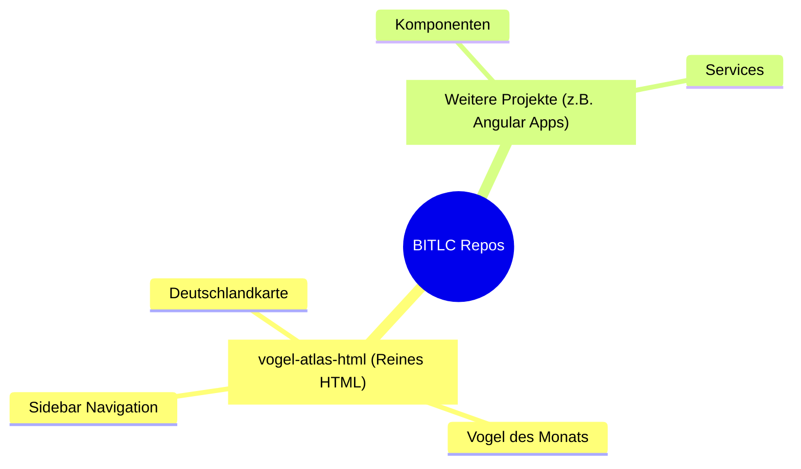
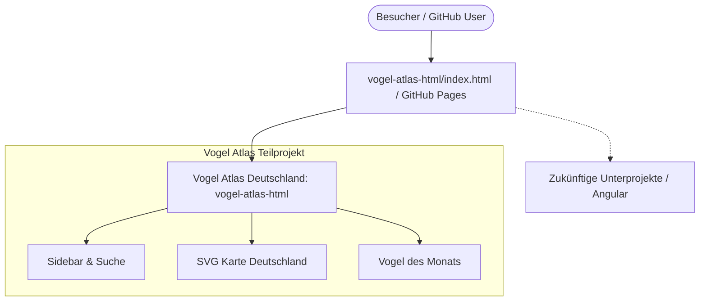

# BITLC Projects Repository

Herzlich willkommen im Projekt-Repository. Dieses Repository ist modular aufgebaut: Jedes Teilprojekt bzw. jede Web-App befindet sich in einem eigenen, klar abgegrenzten Unterordner mit eigener Dokumentation und Quellcode.

---

## Inhaltsverzeichnis (TOC)

1. [Projektübersicht](#projektübersicht)
2. [Repository-Struktur](#repository-struktur)
3. [Unterprojekte](#unterprojekte)
   - [1. Vogel Atlas Deutschland (HTML)](#1-vogel-atlas-deutschland-html)
4. [Architektur & Navigationsfluss](#architektur--navigationsfluss)
5. [Code-Beispiel](#code-beispiel)
6. [Bereitstellung auf GitHub Pages (Direkt im Browser ansehen)](#bereitstellung-auf-github-pages-direkt-im-browser-ansehen)
7. [Lokale Installation & Ausführung](#lokale-installation--ausführung)

---

## Projektübersicht

Das Repository dient als Sammelbecken für UI-Konzepte, Webanwendungen und Prototypen (von nativem HTML bis hin zu modernen Framework-Apps wie Angular).



---

## Repository-Struktur

```text
BITLC-Angular/
├── .agents/               # Richtlinien, Kontext & Arbeitsplan
├── .vscode/               # Editor-spezifische Einstellungen
├── vogel-atlas-html/      # Unterprojekt: Vogel Atlas Deutschland
│   ├── README.md          # Detaillierte Dokumentation des Unterprojekts
│   ├── index.html         # Quellcode & Ansicht (Original)
│   └── template.html      # Wiederverwendbare Vorlage mit Breadcrumbs
└── README.md              # Hauptdokumentation (diese Datei)
```

---

## Unterprojekte

### 1. Vogel Atlas Deutschland (HTML)

- **Ordner:** [`/vogel-atlas-html`](./vogel-atlas-html/)
- **Unterliegende Dokumentation:** [vogel-atlas-html/README.md](./vogel-atlas-html/README.md)
- **Beschreibung:** Ein nach einer Handskizze entworfener Prototyp für einen deutschen Vogel-Atlas.
- **Technologien:** Reines HTML5 (ohne CSS, ohne JavaScript), Inline-SVG, semantische Struktur.
- **Vorschau / Datei:** [`vogel-atlas-html/index.html`](./vogel-atlas-html/index.html)

---

## Architektur & Navigationsfluss



---

## Code-Beispiel

Auszug aus der barrierefreien und klickbaren Vektorkarte (`vogel-atlas-html/index.html`):

```html
<!-- Klickbare Region Norddeutschland innerhalb der SVG-Karte -->
<svg class="map-svg" viewBox="0 0 600 750" xmlns="http://www.w3.org/2000/svg">
    <a href="#region-nord">
        <path d="M180,60 L380,40 L450,110 L410,210 L190,200 Z" fill="#d0e1fd" stroke="#333333" stroke-width="2">
            <title>Norddeutschland (SH, HH, MV, NI, HB)</title>
        </path>
        <text x="270" y="130" font-family="sans-serif" font-size="16" fill="#111" font-weight="bold">
            Norddeutschland
        </text>
    </a>
</svg>
```

---

## Bereitstellung auf GitHub Pages (Direkt im Browser ansehen)

GitHub stellt HTML-Dateien standardmäßig im Repository nur als Quelltext dar. Damit Nutzer und Betrachter die Website **sofort interaktiv als echte Webseite im Browser** sehen können, aktivierst du **GitHub Pages**:

### Schritt-für-Schritt Anleitung

1. Öffne dein Repository auf GitHub: `https://github.com/J-Moessmer/BITLC-Angular`
2. Klicke oben auf **Settings** (Einstellungen).
3. Wähle im linken Menü den Punkt **Pages** (unter *Code and automation*).
4. Unter **Build and deployment**:
   - **Source:** Wähle `Deploy from a branch`
   - **Branch:** Wähle `main` und den Ordner `/ (root)`
   - Klicke auf **Save**.
5. Nach 1–2 Minuten ist das Unterprojekt live erreichbar unter:

   ```text
   https://j-moessmer.github.io/BITLC-Angular/vogel-atlas-html/
   ```

---

## Lokale Installation & Ausführung

Für das reine HTML-Projekt ist keine Installation von `node` oder `npm` erforderlich:

1. **Repository klonen:**

   ```bash
   git clone https://github.com/J-Moessmer/BITLC-Angular.git
   cd BITLC-Angular
   ```

2. **Im Browser ansehen:**
   - Datei `vogel-atlas-html/index.html` direkt per Doppelklick öffnen.
   - Alternativ in VS Code Rechtsklick &rarr; **Open with Live Server**.
