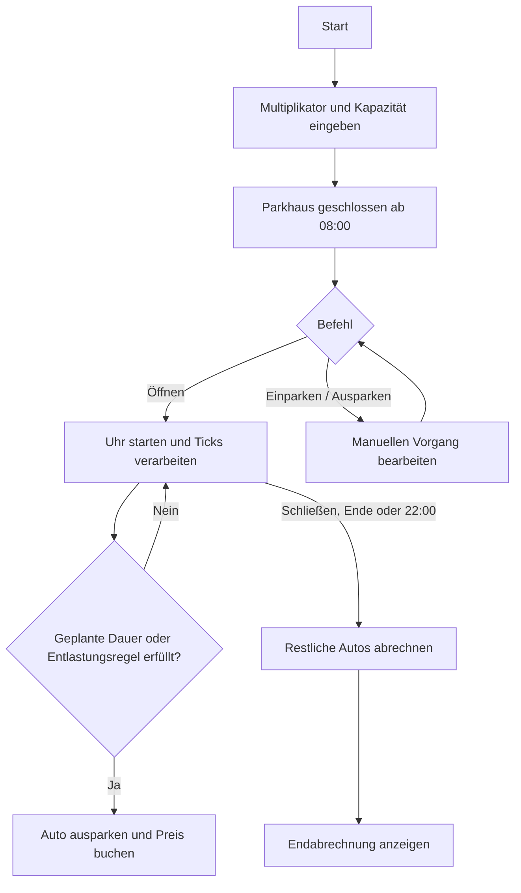

# Parkhaus-Simulation

## Inhaltsverzeichnis

- [Überblick](#überblick)
- [Voraussetzungen und Start](#voraussetzungen-und-start)
- [Bedienung](#bedienung)
- [Simulation und Regeln](#simulation-und-regeln)
- [Preisberechnung](#preisberechnung)
- [Projektstruktur](#projektstruktur)
- [Planung](#planung)
- [Hinweis](#hinweis)

## Überblick

Die Parkhaus-Simulation ist ein TypeScript-Lernprojekt mit einer Terminalversion und einer interaktiven Browserversion. Beide Varianten stellen eine Parkhausuhr, zufällige und manuelle Einfahrten, Ausfahrten, Gebühren und eine Endabrechnung dar.

Die Browserversion kann direkt auf GitHub Pages geöffnet werden: [Parkhaus online](./index.html).

## Voraussetzungen und Start

Benötigt werden Node.js und npm. Die Repository-Abhängigkeiten werden im Hauptverzeichnis installiert:

```bash
npm install
```

Danach im Parkhaus-Ordner starten:

```bash
cd "Typescript intro/Parkhaus"
npx ts-node Parkhaus.ts
```

Für die Browserversion wird TypeScript aus dem Repository-Hauptverzeichnis kompiliert:

```bash
npm run build:parkhaus
```

Anschließend `index.html` im Browser öffnen. Auf GitHub Pages wird die statische Seite unter `Typescript intro/Parkhaus/` bereitgestellt.

Beim ersten Aufruf kann `npx` fragen, ob `ts-node` temporär heruntergeladen werden soll. Alternativ lässt sich die TypeScript-Konfiguration prüfen:

```bash
npx tsc --noEmit -p tsconfig.json
```

Beim Start werden ein Zeitmultiplikator und die Parkhausgröße abgefragt. Für die Kapazität gilt der Standardwert `25`, wenn die Eingabe leer bleibt. Andernfalls muss eine positive ganze Zahl eingegeben werden. Der Zeitmultiplikator muss positiv sein; `1` entspricht einem simulierten Tick pro realer Minute, `60` entspricht 60 simulierten Minuten pro realer Minute.

## Bedienung

Nach den Startabfragen zeigt die UI den Status, die Belegung, Kennzeichen, Simulationszeit und Einnahmen. Befehle werden in der Terminalzeile eingegeben:

| Befehl | Wirkung |
| --- | --- |
| `Öffnen` | Öffnet das Parkhaus und startet die Simulationsuhr. |
| `Einparken` | Erzeugt manuell ein Auto, wenn das Parkhaus offen und nicht voll ist. |
| `Ausparken` | Fragt ein Kennzeichen ab, fährt das passende Auto aus und bucht den Preis. |
| `Einnahmen` | Zeigt bereits verbuchte Einnahmen, den aktuellen Wert der geparkten Autos und den Gesamtwert bei sofortiger Ausfahrt. |
| `Schließen` oder `Ende` | Fährt alle verbleibenden Autos aus und zeigt die Endabrechnung. |

Automatische Zufallseinfahrten erfolgen zusätzlich während des geöffneten Betriebs. Nicht unterstützte Befehle werden als noch nicht implementiert gemeldet.

## Simulation und Regeln

- Der Simulationstag beginnt um `08:00`; nach 840 Ticks endet er um `22:00`.
- Ein Tick entspricht einer simulierten Minute. Der Multiplikator verändert nur die Geschwindigkeit der Simulation.
- Bei jedem Tick besteht eine 50-%-Chance auf eine automatische Einfahrt, solange das Parkhaus geöffnet und noch nicht voll ist.
- Kennzeichen bestehen aus vier Ziffern und werden bei gleichzeitig geparkten Autos nicht doppelt vergeben.
- Für jedes Auto wird eine geplante Parkdauer von 1 bis 1440 Minuten erzeugt. Bei Ablauf wird das Auto automatisch ausgeparkt und abgerechnet.
- Alle 120 Ticks wird die Belegung geprüft. Liegt sie über 80 %, können bis zu `floor(Kapazität × 10 %)` der ältesten Autos ausfahren, sofern sie mindestens 240 Ticks (vier Stunden) geparkt haben.
- Bei `Schließen`, `Ende` oder um `22:00` werden alle verbleibenden Autos ausgefahren. Die Abrechnung listet alle erfassten Kennzeichen.



## Preisberechnung

Jede angefangene Parkstunde wird voll berechnet. Die erste Stunde kostet `1,00 €`; der Stundensatz sinkt für jede weitere Stunde um `0,10 €` und fällt nicht unter `0,00 €`. Beträge werden intern in Cent gespeichert. Auch eine Dauer von null bis unter 60 Minuten wird mindestens als eine Stunde berechnet.

| Berechnete Parkdauer | Preis |
| --- | ---: |
| Bis einschließlich 1 Stunde | `1,00 €` |
| 2 Stunden | `1,90 €` |
| 4 Stunden | `3,40 €` |
| Ab 11 Stunden | maximal `5,50 €` |

Der Befehl `Einnahmen` berechnet den aktuellen Preis jedes noch geparkten Autos so, als würde es jetzt ausfahren. Diese Schätzung wird zu den bereits verbuchten Einnahmen addiert. Die Abfrage verändert weder den Parkstatus der Autos noch den Einnahmenstand.

## Projektstruktur

- `Parkhaus.ts` – Terminal-App, Parkhausmodell, Tick-Logik, Ein-/Ausfahrten, Preisberechnung und ANSI-UI
- `index.html` und `Parkhaus ONLINE.ts` – Browseroberfläche und browserbasierte Simulation
- `tsconfig.browser.json` – TypeScript-Konfiguration für die statische Browserdatei
- `tsconfig.json` – TypeScript-Konfiguration für das Parkhaus
- `Plannung/Projektplan.md` – Aufgabenstellung und fachliche Planung
- `assets/` – Projektressourcen

## Planung

Der aktuelle Funktionsumfang entwickelt sich entlang des [Projektplans](./Plannung/Projektplan.md). Optionale steuerbare Testläufe mit `MengeEin`, `MengeAus` und `Zeitraum` sind noch nicht implementiert.

## Hinweis

Dieses Projekt dient ausschließlich zum Lernen und Üben. Es wird ohne Gewährleistung bereitgestellt und ist nicht für den produktiven Einsatz bestimmt.
