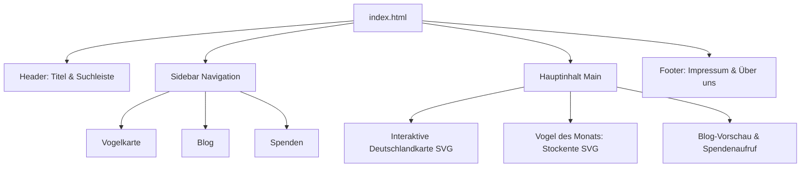

# Vogel Atlas Deutschland (Reines HTML-Projekt)

Ein leichtgewichtiger Prototyp für den **Vogel Atlas Deutschland**, realisiert in **reinem HTML** (ohne CSS, ohne JavaScript).

---

## Inhaltsverzeichnis (TOC)

- [Überblick](#überblick)
- [Features](#features)
- [Dateistruktur](#dateistruktur)
- [Architektur](#architektur)
- [Code-Beispiele](#code-beispiele)
- [Lokale Ausführung](#lokale-ausführung)
- [Online-Bereitstellung](#online-bereitstellung)

---

## Überblick

Dieses Unterprojekt bildet die Umsetzung einer Handskizze für einen Vogel-Atlas nach. Es benötigt keine externen Frameworks, Build-Tools oder Laufzeitumgebungen und kann direkt in jedem modernen Webbrowser geöffnet werden.

---

## Features

- **Responsives Kopfband:** Titel und Suchleiste mit Barrierefreiheits-Labels.
- **2-Spalten-Layout:** Navigations-Sidebar links, strukturierter Hauptinhalt rechts.
- **Interaktive SVG-Deutschlandkarte:** Klickbare Regionen (Nord, West, Ost, Süd) ohne externes Bildmaterial.
- **Vogel des Monats:** Integrierter Steckbrief inklusive Vektor-Grafik.
- **Semantic HTML5:** Einsatz von `<header>`, `<nav>`, `<main>`, `<section>`, `<article>`, `<fieldset>` und `<footer>`.

---

## Dateistruktur

```text
vogel-atlas-html/
├── README.md      # Dokumentation des Teilprojekts
└── index.html     # Haupt-HTML-Seite mit integrierter Vektorgrafik und Layout
```

---

## Architektur



---

## Code-Beispiele

### 1. Interaktive SVG-Region

```html
<svg viewBox="0 0 600 750" xmlns="http://www.w3.org/2000/svg">
    <a href="#region-nord">
        <path d="M180,60 L380,40 L450,110 L410,210 L190,200 Z" fill="#d0e1fd" stroke="#333333" stroke-width="2">
            <title>Norddeutschland</title>
        </path>
        <text x="270" y="130" font-family="sans-serif" font-size="16" fill="#111111" font-weight="bold">Norddeutschland</text>
    </a>
</svg>
```

### 2. Semantischer Steckbrief

```html
<fieldset>
    <legend><h2>Vogel des Monats</h2></legend>
    <table>
        <tbody>
            <tr>
                <td><!-- SVG Grafik --></td>
                <td>
                    <h3>Stockente (Anas platyrhynchos)</h3>
                    <p><strong>Größe:</strong> ca. 50–65 cm</p>
                </td>
            </tr>
        </tbody>
    </table>
</fieldset>
```

---

## Lokale Ausführung

1. Öffne die Datei [index.html](file:///c:/Users/Jmoessmer/Documents/_GITHUB_Repos/BITLC-Angular/vogel-atlas-html/index.html) per Doppelklick in einem Browser deiner Wahl.
2. Alternativ über VS Code mit der Erweiterung **Live Server** starten:
   - Rechtsklick auf `index.html` &rarr; `Open with Live Server`.

---

## Online-Bereitstellung

Informationen zur Bereitstellung über **GitHub Pages** findest du in der [Haupt-README](../README.md#bereitstellung-auf-github-pages-direkt-im-browser-ansehen).
