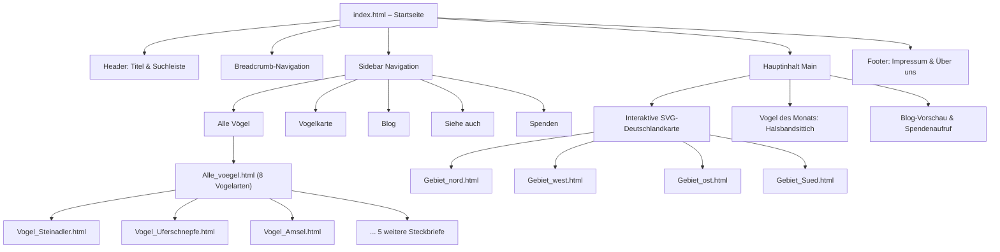
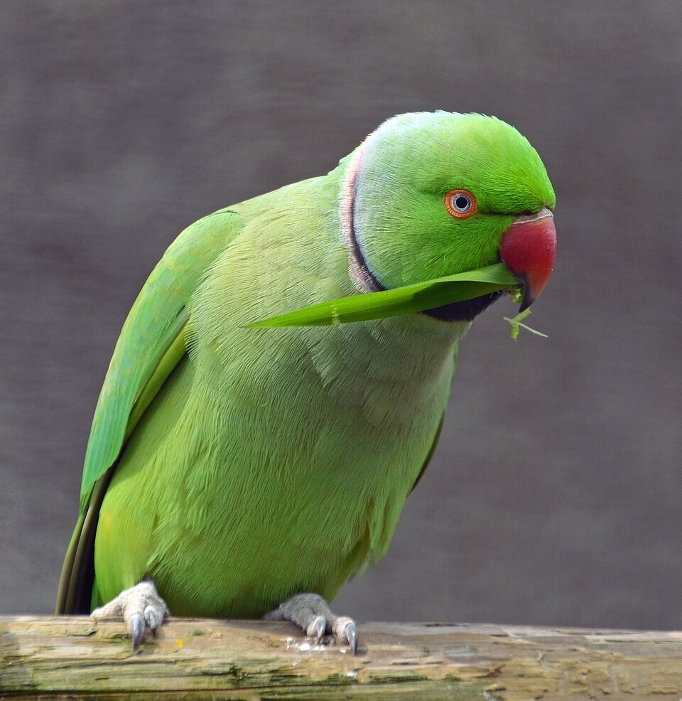

# VogelFinder – Vogel Atlas Deutschland (Reines HTML-Projekt)

Eine vollständige Multi-Page-Website für den **Vogel Atlas Deutschland**, realisiert in **reinem HTML** (ohne CSS, ohne JavaScript) – bestehend aus 18 Seiten mit Vogel-Steckbriefen, Regionsübersichten, Blog und mehr.

---

## Inhaltsverzeichnis (TOC)

- [Überblick](#überblick)
- [Features](#features)
- [Seitenübersicht](#seitenübersicht)
- [Dateistruktur](#dateistruktur)
- [Architektur](#architektur)
- [Code-Beispiele](#code-beispiele)
- [Lokale Ausführung](#lokale-ausführung)
- [Online-Bereitstellung](#online-bereitstellung)

---

## Überblick

Dieses Unterprojekt bildet die Umsetzung einer Handskizze für einen Vogel-Atlas nach. Es benötigt keine externen Frameworks, Build-Tools oder Laufzeitumgebungen und kann direkt in jedem modernen Webbrowser geöffnet werden. Was als einfacher Prototyp begann, ist mittlerweile zu einer kompletten Website mit 18 HTML-Seiten herangewachsen.

---

## Features

- **Startseite mit interaktiver SVG-Deutschlandkarte:** Klickbare Regionen (Nord, West, Ost, Süd) verlinken auf eigene Regionsseiten.
- **8 Vogel-Steckbriefe** mit Fotos: Amsel, Halsbandsittich, Haussperling, Kohlmeise, Nebelkrähe, Rotkehlchen, Steinadler, Uferschnepfe.
- **4 Regionsseiten** (Nord, West, Ost, Süd): Zeigen regionale Vogelauswahl als Bildergalerie.
- **Alle-Vögel-Übersicht:** Bildergalerie mit allen 8 Vogelarten als verlinkte Kacheln.
- **Vogel des Monats:** Hervorgehobener Steckbrief auf der Startseite (aktuell: Halsbandsittich).
- **Blog** mit 3 Artikeln: Kranich-Herbstzug, Gartenvielfalt und VogelFinder-KI-Update.
- **Spendenseite, Siehe-Auch und Datenschutz/Impressum.**
- **Einheitliches Template-System:** Wiederverwendbare Seitenvorlage (`template.html`) mit Header, Breadcrumb-Navigation, Sidebar und Footer.
- **Semantic HTML5:** Einsatz von `<header>`, `<nav>`, `<main>`, `<section>`, `<article>`, `<fieldset>` und `<footer>`.
- **12 Bild-Assets:** Vogelfotos (JPG), Illustrationen (PNG) und GIFs.

---

## Seitenübersicht

| Seite | Datei | Beschreibung |
|---|---|---|
| **Startseite** | `index.html` | SVG-Karte, Vogel des Monats, Blog-Vorschau, Spendenaufruf |
| **Alle Vögel** | `Alle_voegel.html` | Bildergalerie aller 8 Vogelarten |
| **Steinadler** | `Vogel_Steinadler.html` | Steckbrief mit Foto |
| **Uferschnepfe** | `Vogel_Uferschnepfe.html` | Steckbrief mit Foto |
| **Amsel** | `Vogel_Amsel.html` | Steckbrief mit Foto |
| **Haussperling** | `Vogel_Haussperling.html` | Steckbrief mit Foto |
| **Nebelkrähe** | `Vogel_Nebelkraehe.html` | Steckbrief mit Foto |
| **Kohlmeise** | `Vogel_Kohlmeise.html` | Steckbrief mit Foto |
| **Halsbandsittich** | `Vogel_Halsbandsittich.html` | Steckbrief mit Foto (Vogel des Monats) |
| **Rotkehlchen** | `Vogel_Rotkehlchen.html` | Steckbrief mit Foto |
| **Norddeutschland** | `Gebiet_nord.html` | Regionale Vogelauswahl |
| **Westdeutschland** | `Gebiet_west.html` | Regionale Vogelauswahl |
| **Ostdeutschland** | `Gebiet_ost.html` | Regionale Vogelauswahl |
| **Süddeutschland** | `Gebiet_Sued.html` | Regionale Vogelauswahl |
| **Blog** | `Blog.html` | 3 Blogartikel mit Bildern |
| **Spenden** | `Spenden.html` | Spendenseite |
| **Siehe Auch** | `Siehe Auch.html` | Weiterführende Links |
| **Datenschutz** | `Datenschutzimpressum.html` | Impressum & Datenschutz |

---

## Dateistruktur

```text
vogel-atlas-html/
├── Assets/                                   # Bilder & Medien (12 Dateien)
│   ├── 015_Wild_Golden_Eagle_...jpg          # Steinadler-Foto
│   ├── Black-tailed_Godwit_...jpg            # Uferschnepfe-Foto
│   ├── Common_Blackbird.jpg                  # Amsel-Foto
│   ├── Common_crane_grus_grus.jpg            # Kranich-Foto (Blog)
│   ├── House_sparrow_male_...jpg             # Haussperling-Foto
│   ├── Nebelkraehe_Corvus_cornix_...jpg      # Nebelkrähe-Foto
│   ├── Parus_major_Luc_Viatour.jpg           # Kohlmeise-Foto
│   ├── Perruche_à_collier_...jpg             # Halsbandsittich-Foto
│   ├── Robin_(9509442456).jpg                # Rotkehlchen-Foto
│   ├── b2e9ceb91a2be5f0...png                # Blog-Illustration (KI-Erkennung)
│   ├── money-cat-meme.gif                    # Spenden-GIF
│   └── 4ayejy.gif                            # Easter-Egg-GIF
├── index.html                                # Startseite
├── Alle_voegel.html                          # Alle Vögel (Galerie)
├── Vogel_Amsel.html                          # Steckbrief: Amsel
├── Vogel_Halsbandsittich.html                # Steckbrief: Halsbandsittich
├── Vogel_Haussperling.html                   # Steckbrief: Haussperling
├── Vogel_Kohlmeise.html                      # Steckbrief: Kohlmeise
├── Vogel_Nebelkraehe.html                    # Steckbrief: Nebelkrähe
├── Vogel_Rotkehlchen.html                    # Steckbrief: Rotkehlchen
├── Vogel_Steinadler.html                     # Steckbrief: Steinadler
├── Vogel_Uferschnepfe.html                   # Steckbrief: Uferschnepfe
├── Gebiet_nord.html                          # Region: Norddeutschland
├── Gebiet_west.html                          # Region: Westdeutschland
├── Gebiet_ost.html                           # Region: Ostdeutschland
├── Gebiet_Sued.html                          # Region: Süddeutschland
├── Blog.html                                 # Blog (3 Artikel)
├── Spenden.html                              # Spendenseite
├── Siehe Auch.html                           # Weiterführende Links
├── Datenschutzimpressum.html                 # Impressum & Datenschutz
├── template.html                             # Wiederverwendbare Seitenvorlage
└── README.md                                 # Dokumentation (diese Datei)
```

---

## Architektur



---

## Code-Beispiele

### 1. Interaktive SVG-Region

```html
<svg viewBox="0 0 600 750" xmlns="http://www.w3.org/2000/svg">
    <a href="Gebiet_nord.html">
        <path d="M180,60 L380,40 L450,110 L410,210 L190,200 Z" fill="#d0e1fd" stroke="#333333" stroke-width="2">
            <title>Norddeutschland (SH, HH, MV, NI, HB)</title>
        </path>
        <text x="270" y="130" font-family="sans-serif" font-size="16" fill="#111111" font-weight="bold">Norddeutschland</text>
    </a>
</svg>
```

### 2. Vogel-Steckbrief mit Foto

```html
<fieldset>
    <legend><h2>Vogel des Monats</h2></legend>
    <table>
        <tbody>
            <tr>
                <td>
                    
                </td>
                <td>
                    <h3>Halsbandsittich</h3>
                    <p>Der Halsbandsittich ist ein auffälliger, tropischer Papagei...</p>
                    <p><a href="Vogel_Halsbandsittich.html">&rarr; Mehr erfahren</a></p>
                </td>
            </tr>
        </tbody>
    </table>
</fieldset>
```

### 3. Bildergalerie (Alle Vögel)

```html
<table border="0" cellpadding="10">
    <tr>
        <td align="center" valign="top">
            <a href="Vogel_Steinadler.html">
                <br>
                Steinadler
            </a>
        </td>
        <!-- ... weitere Vogelkacheln ... -->
    </tr>
</table>
```

---

## Lokale Ausführung

1. Öffne die Datei `index.html` per Doppelklick in einem Browser deiner Wahl.
2. Alternativ über VS Code mit der Erweiterung **Live Server** starten:
   - Rechtsklick auf `index.html` &rarr; `Open with Live Server`.

---

## Online-Bereitstellung

Die Website ist über **GitHub Pages** direkt erreichbar:

<https://j-moessmer.github.io/BITLC-Angular/vogel-atlas-html/>

Weitere Informationen zur Konfiguration findest du in der [Haupt-README](../README.md#bereitstellung-auf-github-pages-direkt-im-browser-ansehen).
